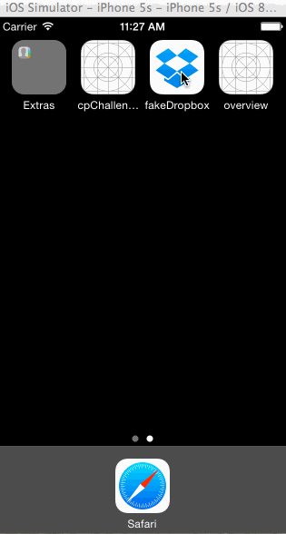

# fakeDropbox

CodePath assignment - Recreate Dropbox visual flow using custom view controllers, buttons, images, scrollviews, manual segues, navigation controllers, and tab bar controllers.

Time spent: 5 hours spent in total

Completed user stories:
<ul>
  <li>User can tap through the 3 welcome screens.</li>
  <li>User can follow the create user flow.</li>
  <li>On the create user form, the user can tap the back button to go to the page where they can sign in or create an account.</li>
  <li>Before creating the account, user can choose to read the terms of service.</li>
  <li>After creating the account, user can view the placeholders for Files, Photos, and Favorites as well as the Settings screen.</li>
  <li>User can log out from the Settings screen.</li>
  <li>User can follow the sign in flow.</li>
  <li>User can tap the area for "Having trouble signing in?"</li>
  <li>User can log out from the Settings screen.</li>
</ul>

Walkthrough of all user stories:

